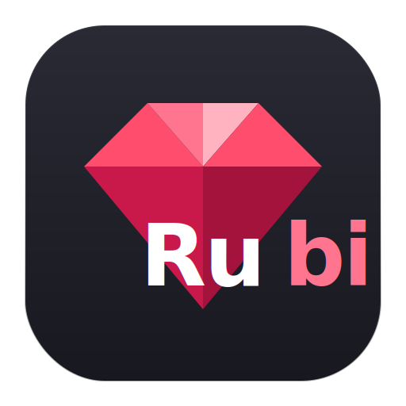

<div align="center">
  
  <h1>Rubi (ルビ)</h1>
  <p><strong>몰입형 AI 일본어 후리가나 & 문맥 번역 브라우저 확장 프로그램</strong></p>
  <p>
    <a href="README.md">English</a> |
    <a href="README.zh-CN.md">简体中文</a> |
    <a href="README.ja.md">日本語</a> |
    <a href="README.ko.md"><b>한국어</b></a>
  </p>
  <p>
    <a href="https://github.com/Ousinki/rubi-extension/blob/main/LICENSE">
      
    </a>
    
    
  </p>
</div>

**Rubi**는 몰입감 있고 방해 없는 일본어 독서 및 학습 경험을 위해 설계된 차세대 브라우저 확장 프로그램입니다. 일본어 웹페이지에 자동으로 후리가나(루비 어노테이션)를 삽입하고, 독서 흐름을 방해하지 않으면서 문맥 인식 AI 해설과 단락별 인라인 번역을 제공합니다.

---

## ✨ 주요 기능

- **📖 전체 페이지 후리가나(Ruby) 자동 삽입:** 일본어 한자에 즉시 히라가나 독음을 표기합니다. JLPT 레벨(N5~N1)로 필터링하여 자신의 실력에 맞게 표시할 수 있습니다.
- **🔍 단어 검색 & 사전 기능:** 고성능 오프라인 일본어 사전 엔진(`@birchill/jpdict-idb` / 10ten-ja-reader)이 탑재되어 있으며, 활용형 동사 및 사변동사(サ変動詞)의 어간 복원 검색을 지원합니다.
- **🧠 문맥 인식 AI 해설:** 임의의 단어나 선택한 텍스트를 길게 누르면 상세한 문법 해설, 문맥에 맞는 어의, 자주 쓰이는 연어를 담은 플로팅 카드를 표시합니다.
- **⌨️ 단락 인라인 번역:** 단락 전체를 그 자리에서 번역합니다. 번역 결과는 원문 텍스트 블록 바로 아래에 반투명하고 읽기 편한 스타일로 인라인 삽입됩니다. 다양한 트리거 방식을 지원합니다:
  - `Shift` / `Ctrl` / `Alt` 키 + 호버
  - 마우스 길게 누르기
  - 직접 호버 번역
  - 커스텀 키보드 단축키 조합
- **🗣️ 멀티 엔진 텍스트 음성 변환(TTS):** Microsoft Edge 뉴럴 TTS, Google 번역 TTS, 그리고 표현력 풍부한 Voicevox 애니메이션 음성 엔진으로 원어민 발음을 들을 수 있습니다.
- **🎨 프리미엄 UI 디자인:** HSL로 정교하게 조정된 다크 모드와 보석을 모티프로 한 컬러 스킴(아메지스트·루비·시트린·사파이어)을 채용한 아름다운 디자인입니다.

---

## 🚀 설치 및 빌드 방법

Rubi는 [WXT](https://wxt.dev/)와 Vue 3로 개발되었습니다.

### 1. 소스에서 빌드하기

1. 저장소를 클론합니다:
   ```bash
   git clone https://github.com/Ousinki/rubi-extension.git
   cd rubi-extension
   ```
2. 의존 패키지를 설치합니다:
   ```bash
   npm install
   ```
3. 확장 프로그램을 빌드합니다:
   ```bash
   npm run build
   ```
4. 컴파일된 확장 프로그램은 `.output/chrome-mv3` 디렉터리에 출력됩니다.

### 2. Chrome에 로드하기

1. Chrome을 열고 `chrome://extensions/`로 이동합니다.
2. 오른쪽 상단의 **개발자 모드**를 활성화합니다.
3. **압축 해제된 확장 프로그램 로드**를 클릭하고 `.output/chrome-mv3` 디렉터리를 선택합니다.

---

## ⚙️ 환경 설정

Rubi 확장 프로그램 아이콘을 클릭하거나 `options.html`에 접속하여 **옵션 페이지**를 열면 다음 설정을 할 수 있습니다:
- 문맥 번역을 위한 OpenAI 호환 API 키 및 엔드포인트를 입력합니다.
- 기계 번역 엔진을 선택합니다 (Google / DeepL / Bing).
- TTS 읽기 속도, 음량, 음성 캐릭터를 설정합니다.
- 후리가나 표시 스타일과 트리거 키를 커스터마이즈합니다.

---

## 🤝 감사의 말

뛰어난 아키텍처와 영감을 제공해 준 [10ten Japanese Reader](https://github.com/birchill/10ten-ja-reader)와 [MouseTooltipTranslator](https://github.com/ttop32/MouseTooltipTranslator) 프로젝트에 깊이 감사드립니다.

---

## 📜 라이선스

이 프로젝트는 [GPL-2.0 라이선스](LICENSE) 하에 공개되어 있습니다.
