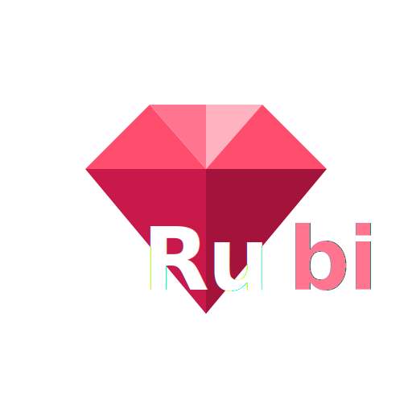

<div align="center">
  
  <h1>Rubi (ルビ)</h1>
  <p><strong>沉浸式 AI 日语振假名注音与语境翻译浏览器扩展</strong></p>
  <p>
    <a href="README.md">English</a> |
    <a href="README.zh-CN.md"><b>简体中文</b></a> |
    <a href="README.ja.md">日本語</a> |
    <a href="README.ko.md">한국어</a>
  </p>
  <p>
    <a href="https://github.com/Ousinki/rubi-extension/blob/main/LICENSE">
      
    </a>
    
    
  </p>
</div>

**Rubi** 是一款专为日语学习和沉浸式阅读设计的下一代浏览器扩展。它能够在不破坏网页原有日文排版的前提下，自动在汉字上方注入振假名（Furigana/ルビ），并支持 AI 语境分析、本地离线字典查询以及整段内联翻译，助你流畅阅读日语网页。

---

## ✨ 功能特性

- **📖 全文振假名（Ruby）自动注入：** 智能识别日文汉字并标注平假名。支持按 JLPT 级别（N5 ~ N1）筛选显示，贴合你的实际日语水平。
- **🔍 本地离线词典查询：** 集成了高性能离线日语词典引擎（`@birchill/jpdict-idb` / 10ten-ja-reader），支持动词活用形、サ变动词等自动还原词干检索。
- **🧠 AI 语境语法分析：** 长按任意单词或选中文本，即可召唤浮动卡片，查看详尽的语法解释、契合上下文的释义及常用搭配。
- **⌨️ 整段内联翻译：** 支持对鼠标悬停的段落进行整段内联翻译，翻译结果以半透明、低侵入式的灰色文字直接插入在原文下方。支持多种触发触发方式：
  - `Shift` / `Ctrl` / `Alt` 修饰键 + 悬停触发
  - 鼠标左键长按触发
  - 直接悬停翻译
  - 自定义录制快捷键触发
- **🗣️ 多引擎语音朗读（TTS）：** 支持微软 Edge 神经网络语音、谷歌翻译 TTS 以及二次元 Voicevox Expressive 语音引擎，提供纯正的发音体验。
- **🎨 宝石主题皮肤：** 提供精美的深色模式，并支持与不同宝石（紫水晶、红宝石、黄水晶、蓝宝石）主题色的联动。

---

## 🚀 安装与构建

项目基于 [WXT](https://wxt.dev/) 框架与 Vue 3 开发。

### 1. 源码编译构建

1. 克隆本仓库：
   ```bash
   git clone https://github.com/Ousinki/rubi-extension.git
   cd rubi-extension
   ```
2. 安装依赖：
   ```bash
   npm install
   ```
3. 构建扩展包：
   ```bash
   npm run build
   ```
4. 编译好的扩展代码将会输出至 `.output/chrome-mv3` 文件夹。

### 2. 加载到浏览器

1. 打开 Chrome 浏览器，访问 `chrome://extensions/`。
2. 开启右上角的 **“开发者模式”**。
3. 点击 **“加载已解压的扩展程序”**，选择 `.output/chrome-mv3` 文件夹即可。

---

## ⚙️ 偏好设置

点击 Rubi 扩展图标或访问 `options.html` 进入**设置页面**，在这里你可以：
- 填入你自己的 OpenAI 兼容 API 密钥和自定义端点，启用 AI 语境翻译。
- 自由切换机器翻译引擎（Google / DeepL / Bing）。
- 设置 TTS 发音速度、音量及 Voicevox 发音角色。
- 定制振假名标注的显示样式及触发按键。

---

## 🤝 鸣谢

特别鸣谢 [10ten Japanese Reader](https://github.com/birchill/10ten-ja-reader) 与 [MouseTooltipTranslator](https://github.com/ttop32/MouseTooltipTranslator) 项目在架构和多引擎翻译逻辑上的启发。

---

## 📜 开源协议

本项目采用 [GPL-2.0](LICENSE) 开源协议。
